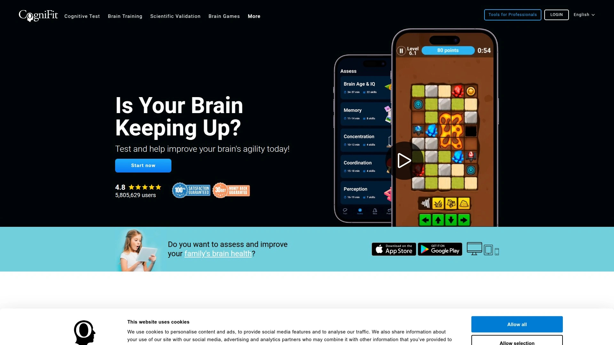
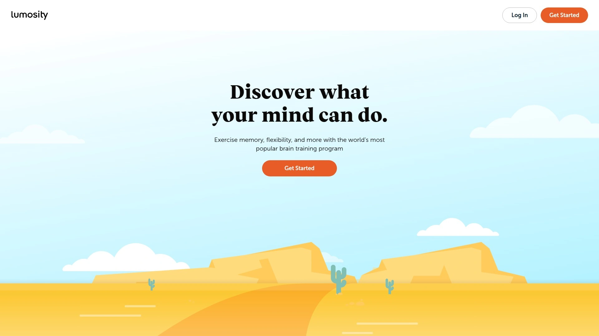
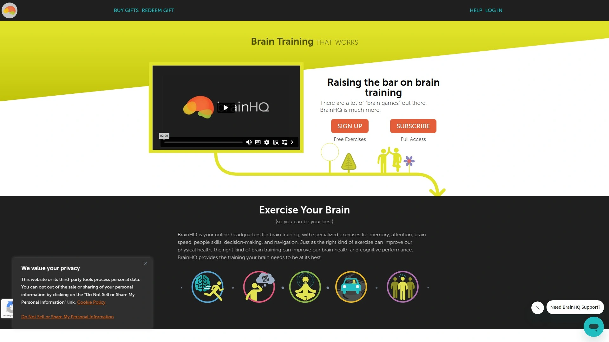
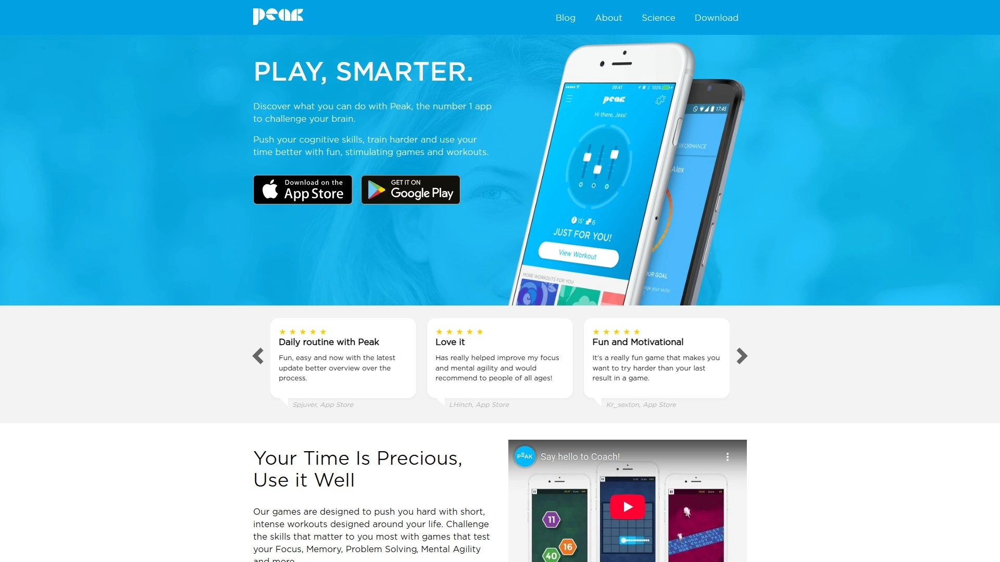
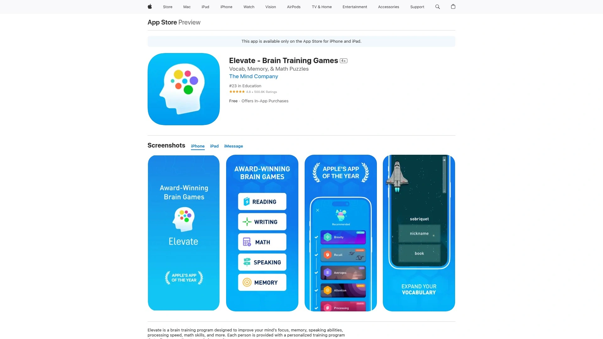
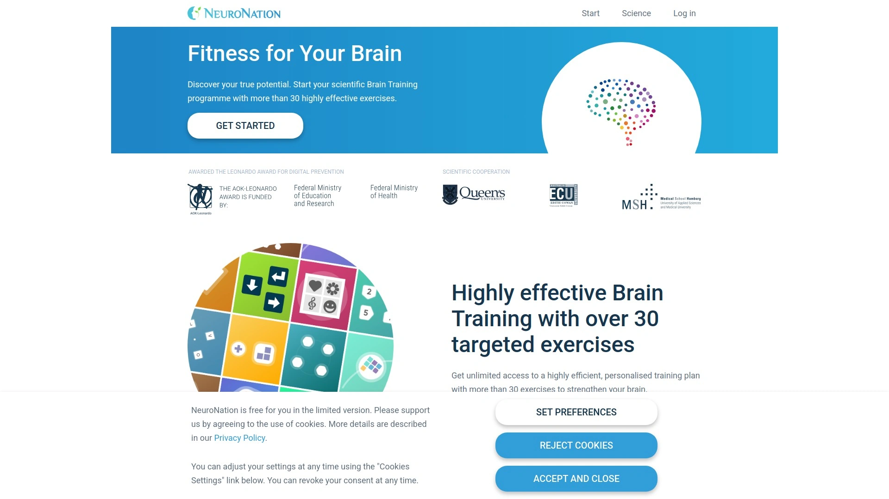
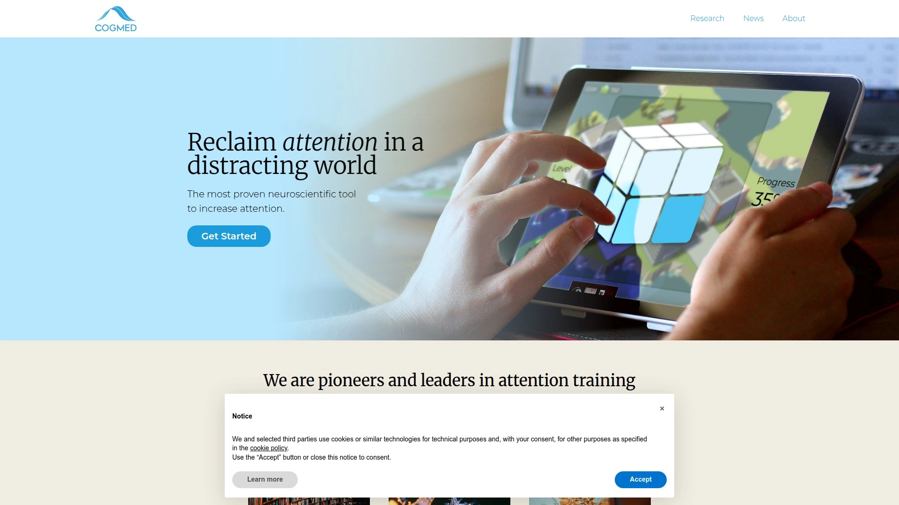
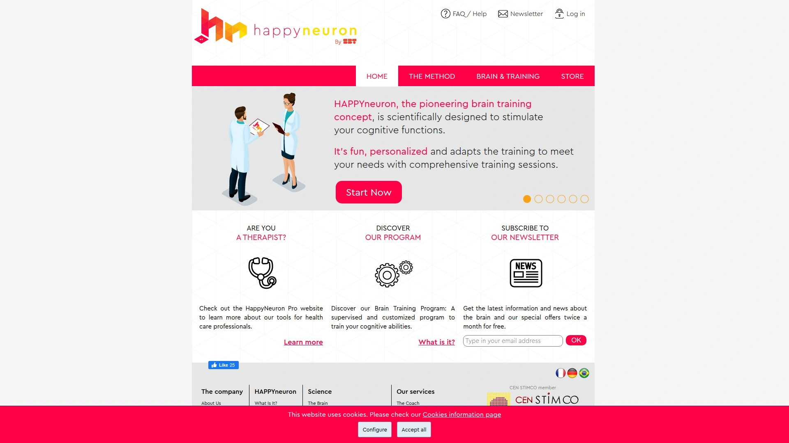
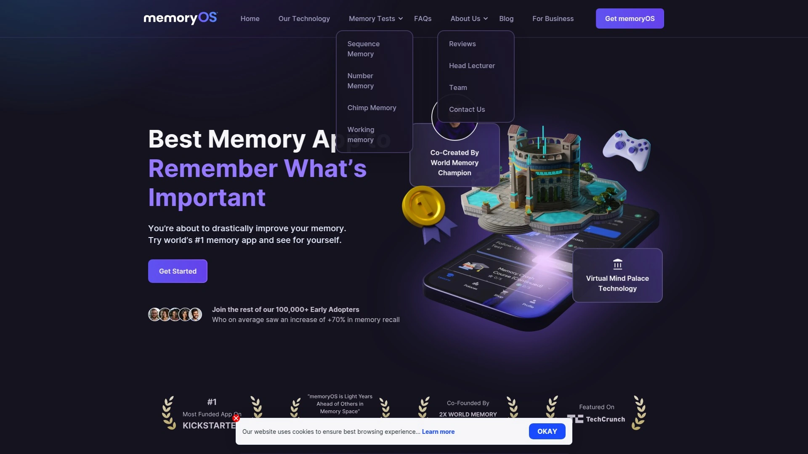

# 2025's Top 9 Best Brain Training Platforms

Your brain isn't a static organ—it's more like a muscle that either gets stronger with exercise or weaker from neglect. Whether you're trying to stay sharp as you age, bounce back from cognitive challenges, or simply give your mental performance an edge, brain training platforms offer scientifically-backed exercises that target memory, attention, processing speed, and problem-solving abilities. The right platform turns daily mental workouts into measurable cognitive improvements, with some users reporting gains equivalent to shaving years off their brain age.

***

## **[CogniFit](https://www.cognifit.com)**

Clinical-grade brain training trusted by doctors and researchers worldwide.

CogniFit stands apart by measuring over 22 different cognitive domains through validated neuropsychological assessments, functioning like a thermometer for brain health rather than just another game collection. The platform creates personalized training programs using AI algorithms that identify weak areas and recommend targeted exercises, similar to how a personal trainer would design workouts around your specific fitness gaps. Over 135 million games have been played across their system, with participation from more than 6,115 clinics and research institutions conducting studies.

The platform serves multiple audiences through specialized accounts for healthcare professionals managing patients, researchers conducting cognitive studies, educators working with students, and individuals pursuing personal brain health. Each user receives baseline cognitive scores, weekly training recommendations (typically 20 minutes three times weekly), and detailed progress reports tracking development over time. Unlike repetitive puzzle games, CogniFit implements adaptive difficulty that presents new challenges as you improve, creating neuronal pathway connections through varied stimulation.

Healthcare professionals particularly value CogniFit because it's clinically proven, reimbursable through insurance in some cases, and provides quantifiable data for tracking patient progress. The platform works across smartphones, tablets, and computers, making brain training accessible anywhere. Scientific research spanning over 20 years supports the program's efficacy in improving cognitive abilities.

***

## **[Lumosity](https://www.lumosity.com)**

The original brain training pioneer backed by 100 million users' data.

Lumosity pioneered the commercial brain training movement and continues innovating while maintaining its science-backed methodology. The platform measures gains across multiple cognitive domains through an overall performance index, improving memory, attention, flexibility, problem-solving speed, and language abilities. Developed through the Human Cognition Project, Lumosity leverages insights from over 100 million users to refine its approach.

Adaptive training tracks adjust automatically to match your cognitive profile and training objectives, whether you're focused on stress management or creative thinking. Users receive personalized daily training sessions that evolve based on performance patterns, keeping exercises challenging without becoming frustrating. The platform's game catalog covers diverse cognitive tasks, from memory challenges to mathematical reasoning.

Recognition from major publications like CNET positions Lumosity as a leader in the competitive brain training space. The platform works best for individuals seeking comprehensive cognitive maintenance and those interested in comparing their performance against demographic benchmarks.

***

## **[BrainHQ](https://www.brainhq.com)**

The only platform with peer-reviewed proof of real-world cognitive improvements.

BrainHQ distinguishes itself as the sole brain training app with exercises proven through numerous peer-reviewed studies to enhance actual real-world cognitive functioning, not just performance on the training tasks themselves. Developed by renowned neuroplasticity scientists, the platform offers clinically validated exercises designed to improve brain health and performance across all age groups.

The adaptive training algorithm personalizes to individual cognitive needs, focusing on memory, attention, processing speed, and social cognition. New dual-task exercises challenge users to execute two mental operations simultaneously, building the multitasking skills essential in modern life. This approach targets the complex reality of daily cognitive demands rather than isolated mental functions.

Research backing BrainHQ spans 30 years and demonstrates measurable benefits for cognitive aging. The platform particularly appeals to older adults concerned about age-related mental decline and individuals recovering from brain injuries or strokes. Exercises adapt continuously to ensure optimal challenge levels that promote growth without overwhelming users.

***

## **[Peak](https://www.peak.net)**

University-designed games with personalized coaching for goal-driven training.

Peak combines user-friendly design with comprehensive cognitive development through a Coach function that builds customized exercise routines based on your specific objectives. The platform enhances memory, problem-solving ability, emotional intelligence, and hand-eye coordination through more than 45 games created in partnership with neuroscientists from top universities including Cambridge and NYU. Over 12 million downloads demonstrate Peak's popularity in the brain training space.

Social challenges enable friends to compete head-to-head, adding motivational elements through friendly competition. Your Brain Map lets you compare performance against people with similar demographics, providing context for your cognitive strengths and areas needing work. Advanced training programs like Wizard Memory, developed with Cambridge University experts, offer specialized deep-dives into specific cognitive skills.

Peak earned recognition as a Google Play Editor's Choice and receives regular updates with fresh content. The platform works offline, allowing brain training anywhere without internet connectivity. Weekly reports highlight key accomplishments and opportunities for improvement, making progress tangible and trackable.

---

## **[Elevate](https://apps.apple.com/us/app/elevate-brain-training-games/id875063456)**

Award-winning training that boosts earning power through practical cognitive skills.

Elevate focuses on practical cognitive abilities proven to boost productivity, earning power, and self-confidence through targeted improvement in critical thinking skills. The app offers over 40 brain training games improving focus, memory, processing speed, math proficiency, grammar, and comprehension. Over 90% of frequent users report improvements in vocabulary, math skills, and overall mental sharpness.

CNET declared Elevate the winner in the brain training app battle, while the Washington Post praised it as a cognitive pick-me-up perfect for mental breaks throughout the workday. Personalized workouts let you customize daily training focus by selecting 3-5 games targeting the skills you need most. Professional narration enhances accessibility for vision-impaired users and diverse learning styles.

Adaptive difficulty progression ensures exercises remain challenging as you improve, preventing plateaus in cognitive development. Spaced repetition techniques now incorporated into Elevate enhance memory retention and long-term recall. The platform works particularly well for professionals seeking to sharpen communication skills and students aiming to boost academic performance.

***

## **[NeuroNation](https://www.neuronation.com)**

German healthcare technology with insurance reimbursement for medical-grade training.

NeuroNation brings medical-grade cognitive training developed by German healthcare technology company Synaptikon GmbH, launched in 2011 and now available in eight languages across global markets. The platform won the AOK Leonardo Health Prize for Digital Prevention sponsored by the German Federal Ministry of Health, demonstrating official recognition of its therapeutic value. Several German health insurers including Deutsche BKK reimburse NeuroNation use, treating it as legitimate preventive healthcare.

Scientifically proven techniques leverage personalized training programs that adapt to your performance, ensuring optimal challenge and growth. NeuroNation performs comprehensive analysis of cognitive strengths and weaknesses, creating customized brain training plans meeting individual needs. The platform targets memory, attention, concentration, and problem-solving through diverse games including puzzles, memory challenges, speed exercises, and logic tasks.

Studies by MSH Medical School Hamburg and the University of Würzburg observed that participants using NeuroNation exercises exhibited improved memory, concentration, and general wellbeing. As you improve, tasks become more complex, promoting continuous cognitive growth without plateaus. Progress tracking with peer group benchmarking shows exactly how your cognitive abilities compare to others in your demographic.

***

## **[Cogmed](https://www.cogmed.com)**

The most proven neuroscientific tool for attention and working memory capacity.

Cogmed delivers research-based, clinically proven computerized training specifically designed to increase working memory capacity and attention spans. Created in the lab of neuroscientist Torkel Klingberg at the Karolinska Institute, Cogmed focuses exclusively on building the working memory muscle that helps remember instructions, solve problems, control impulses, and maintain focus.

The structured program comprises 25 online training sessions, each lasting 30-45 minutes, completed over five weeks with five sessions weekly. A certified Cogmed coach facilitates the first session and provides weekly check-ins to discuss progress, increase motivation, and give feedback. Video-game-like exercises require remembering and repeating sequences—like illuminated panels or asteroid fields—with difficulty adjusting in real-time based on correct and incorrect responses.

Randomized controlled studies demonstrate Cogmed leads to improvements in neuropsychological outcomes and parent-rated ADHD symptoms in youth. Recent systematic reviews show adults in Cogmed training groups exhibit significant enhancements in verbal and visuospatial working memory scores immediately after training, with minor sustained benefits at 2-6 months post-intervention. The program serves as complementary therapy for ADHD, learning disorders, and brain injury recovery.

***

## **[Happy Neuron](https://www.happy-neuron.com)**

Personalized coaching with wellness and performance tracks for complete brain stimulation.

Happy Neuron provides a complete brain training method stimulating five main cognitive functions: memory, attention, language, executive functions (reasoning and logical thinking), and visual-spatial skills. For over 10 years, Happy Neuron's scientific team has offered high-quality service based on latest cognitive science advances, personalization, and engaging game design.

The platform offers distinct wellness and performance program tracks chosen based on personality and expectations, each featuring progressive stages including warm-up, training, and maintenance phases. More than 40 games designed by cognitive psychology specialists train skills like memory, concentration, reasoning, language, and reactivity. The Happy Neuron coach provides personalized guidance directing you toward the most appropriate games for your cognitive profile, tracking tools to monitor progress, and motivation to sustain long-term training commitment.

Adaptive difficulty adjusts to natural ability levels, making training accessible regardless of starting point. The brain games require recognizing, memorizing, and understanding words while training grammar, vocabulary, and verbal fluency. Happy Neuron Pro offers healthcare professionals specialized cognitive therapy tools for clinical applications.

***

## **[memoryOS](https://memoryos.com)**

World memory champion-designed app using virtual mind palaces for 70% recall improvement.

memoryOS takes a fundamentally different approach by teaching memory techniques rather than just exercising existing abilities through repetitive games. Co-created by Jonas Von Essen, a two-time World Memory Champion who won "The Brain" TV show in China and memorized the first 100,000 digits of Pi, the app delivers proven methods used by memory athletes.

Early adopters averaging a 70% increase in memory recall demonstrates the effectiveness of memoryOS's Virtual Mind Palace technology. The platform teaches mnemonic techniques, spaced repetition, and micro-lessons through educational games that help you remember what matters most. Unlike generic brain training apps, memoryOS treats great memory as a learnable skill developed through proper technique rather than innate ability.

The VR Maker creates a mind drive with structured folders where you place and organize information using ancient memory palace methods adapted for modern needs. Gamification keeps memory training effective, fun, and engaging while you build practical skills for remembering names, presentations, study materials, and important information. The app suits anyone frustrated with forgetting important details and ready to master memory enhancement strategies.

---

## FAQ

**Which brain training platform works best for older adults concerned about cognitive decline?**

BrainHQ stands out for seniors because it's the only platform with peer-reviewed studies proving real-world cognitive improvements rather than just better game scores. The exercises specifically target age-related decline, and 30 years of research backs its effectiveness. CogniFit also serves older adults well by functioning like a thermometer for brain health, measuring 22 cognitive domains to catch problems early before they worsen.

**Do brain training apps actually improve everyday mental performance or just game-playing skills?**

The science shows mixed results depending on the platform. BrainHQ uniquely demonstrates transfer to real-world tasks through numerous peer-reviewed studies. Research on other platforms like NeuroNation shows improvements in working memory and executive functions that benefit daily life. However, simple repetitive games without adaptive difficulty and immediate feedback rarely create meaningful cognitive changes. The most effective platforms personalize challenge levels and target multiple cognitive domains rather than drilling the same task repeatedly.

**How much time do I need to commit to see actual cognitive improvements?**

Most platforms recommend 20-30 minutes of training 3-5 times weekly for noticeable results. CogniFit suggests 20-minute sessions three times per week. Peak training takes just 10 minutes daily. Cogmed requires more intensive commitment with 30-45 minute sessions five days weekly over five weeks, but delivers more dramatic working memory improvements. Consistency matters more than duration—regular practice creates stronger neuronal pathways than occasional marathon sessions.

---

## Conclusion

Brain training platforms transform abstract cognitive improvement into measurable daily practice, with options ranging from casual 10-minute workouts to intensive clinical programs. The nine platforms covered each bring distinct advantages—from Peak's university-backed games to Cogmed's focused working memory training. For those seeking comprehensive cognitive assessment alongside adaptive training backed by decades of research, [CogniFit](https://www.cognifit.com) delivers clinical-grade tools trusted by over 6,000 healthcare institutions worldwide, measuring 22 cognitive domains to identify exactly where your brain needs strengthening and creating AI-personalized programs that evolve with your progress. Choose based on your primary goal: maintaining sharpness as you age, recovering from cognitive challenges, or maximizing mental performance for work and life.
